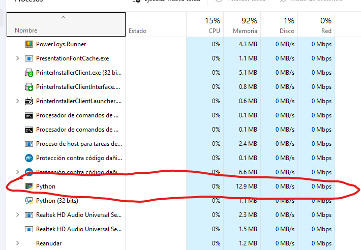

# Tarea 1 - Lanzar un proceso en red

```bash
PS C:\Users\2080414> py -m http.server 8000
Serving HTTP on :: port 8000 (http://[::]:8000/) ...
```

# Tarea 2 - Confirmación de proceso en marcha

```bash
PS C:\Users\2080414> Get-Process python

 NPM(K)    PM(M)      WS(M)     CPU(s)      Id  SI ProcessName
 ------    -----      -----     ------      --  -- -----------
     15    15.19      24.89       0.44   15484   1 python
	 
```

# Tarea 3 - Decubrir proceso por puerto TCP/IP

```bash
PS C:\Users\2080414> Get-NetTCPConnection -LocalPort 8000

LocalAddress                        LocalPort RemoteAddress                       RemotePort State       AppliedSetting
------------                        --------- -------------                       ---------- -----       --------------
::                                  8000      ::                                  0          Listen
```

# Tarea 4 - Taskmgr con proceso



# Tarea 5 - Matar el proceso

```bash
PS C:\Users\2080414> Stop-Process -Id 15484
```

```bash
PS C:\Users\2080414> Get-Process python
Get-Process: No se encuentra un proceso con el nombre "python". Compruebe el nombre del proceso y vuelva a llamar al cmdlet.
```

# Tarea 6 - Parada con SIGKILL

```bash
PS C:\Users\2080414> get-Process python

 NPM(K)    PM(M)      WS(M)     CPU(s)      Id  SI ProcessName
 ------    -----      -----     ------      --  -- -----------
     15    15.58      24.95       0.14   24892   1 python

PS C:\Users\2080414> Stop-Process -Id 24892 -Force
```

**NOTA**: Al parecer en SO Windows, no cambia nada usar el modificador `-Force` a no usarlo, no hay feedback por pantalla al respecto.

# Tarea 7 - Puerto ocupado con otro proceso

Abrimos dos terminales o ventanas y ejecutamos esta vez el servidor por `npx` como proceso **Node**. Esto es así, porque en Windows, no aparece error cuando intentas abrir dos servidores http python por el mismo puerto, simplemente se queda el 2o a la espera sin dar feedback de error ni ninguna otra info, aunque no se está ejecutando.

```
PS C:\Users\2080414> npx http-server -p 8000
node:events:487
      throw er; // Unhandled 'error' event
      ^

Error: listen EADDRINUSE: address already in use 0.0.0.0:8000
    at Server.setupListenHandle [as _listen2] (node:net:2008:16)
    at listenInCluster (node:net:2065:12)
    at node:net:2274:7
    at process.processTicksAndRejections (node:internal/process/task_queues:90:21)
Emitted 'error' event on Server instance at:
    at emitErrorNT (node:net:2044:8)
    at process.processTicksAndRejections (node:internal/process/task_queues:90:21) {
  code: 'EADDRINUSE',
  errno: -4091,
  syscall: 'listen',
  address: '0.0.0.0',
  port: 8000
}

Node.js v24.15.0
```

# Tarea 8 - Explicación de proceso VS. PID

Ver en README/Glosario.