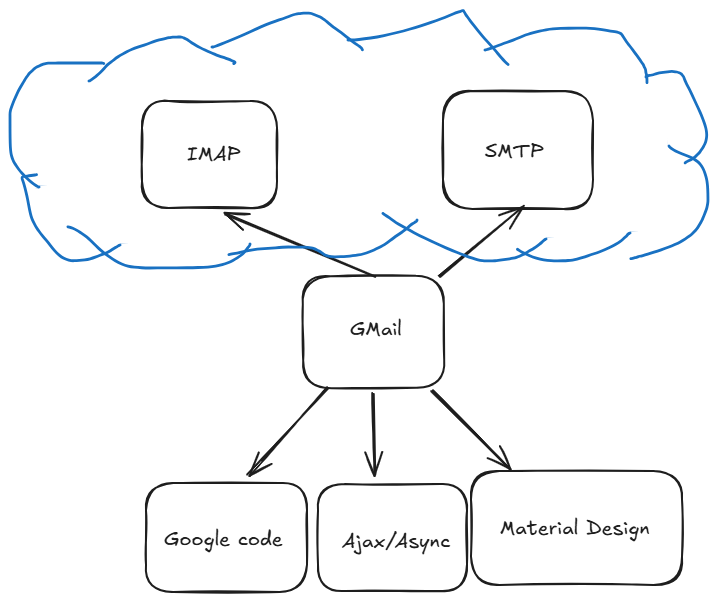

# 1-Clasifica las 15 piezas de la lista

| Pieza | Tipo |	Quién la usa | Quién lleva el control | Dónde corre |
+-------+------+---------+------------------------+-------------+
|1.Spotity| Aplicacion | humano         | La usamos			  |En otra máquina (servidor web)|
|2.Read | Framework | programador       | Ella llama          |
|3.lodash |Librería| programador | La usamos | En local (librería javascript o por `npm`) Es una librería orientead a manipulación de datos para javscript, similar a NumPy de Python |
|4.api.stripe.com| Servicio |programador | La usamos | En remoto (llamada web) |
|5.Django |Framework | programador | Ella llama | En local (código Python) |
|6.Visual Studio Code | Aplicación | programador | La usamos | En local (IDE de Microsoft gratuita) |
|7.Google Chrome| Aplicación | humano | La usamos | En local (Browser que se instala) |
|8.NumPy | Librería | programador | La usamos | En local (Hay que descargar la librería de Python o con `pip`) |
|9.Express | Framework | programador | Ella llama | En local (paquete `npm`) |
|10.WhatsApp |Aplicación | humano |La usamos | En local (app del móvil) |
|11.api.openai.com | Servicio | programador | La usamos | En remoto (llamada web) |
|12.date-fns|Librería| programador | La usamos | Paquete de `npm` |
|13.Next.js | Framework | programador | Nos llama | En local (paquete de nodejs) |
|14.Excel | Aplicación | humano | La usamos | En local (desktop) o webpp remota |
|15.api.github.com | Servicio | programador | La usmaos | En remoto (llamada web a webservice json) |

# 2 — Caso frontera: React

Como se explica en el vídeo, proporciona un punto de partida que llama a nuestro código y a veces él decide cuando se rendereiza un componente y cuando no, por lo tanto es algo que de por sí es stand alone y usa nuestro código para generar funcionalidad.

# 3—Dibuja tu propio stack

He elegido la **Opción B** por ejemplo por disponer de más varibilidad, aunque al ser google, supongo que tiene ofuscado la formad e funcionar por dentro. Más o menos he añadido lo que intuyo que usa externos como son para el diseño visual el Material Design de Google, código javascript en Ajax y promises para recargar el contenido y refrescar emails entrantes y el envío en asíncrono, y alguna api o librerías de Google que usa como helpers o herramientas.

