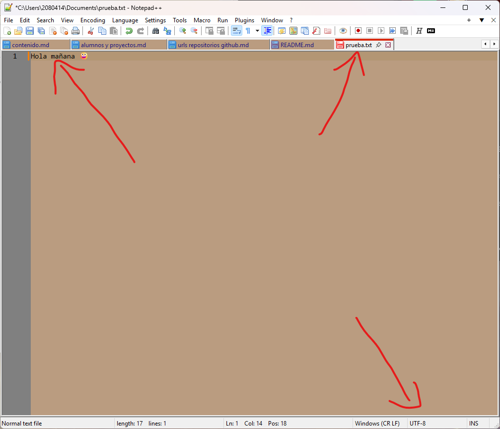
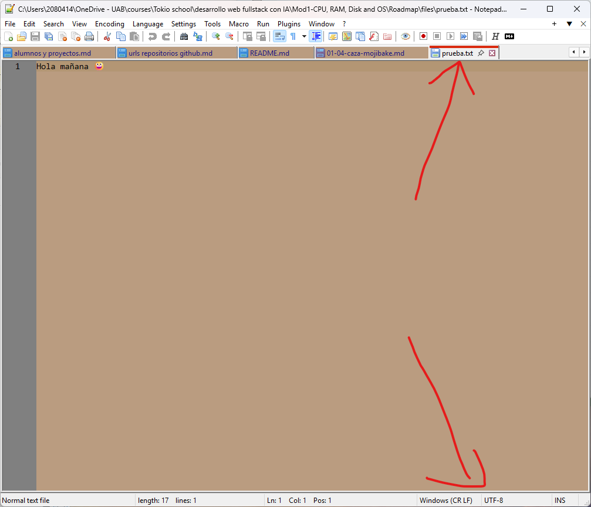

**NOTA**: El archivo de referencia es `pruebas.txt` ubicado en [pruebas.txt](../../files/pruebas.txt).

# Paso 1. Crea el archivo de prueba

# Paso 2. Mira los bytes reales del archivo

**NOTA**: Es una captura doble del mismo archivo, aprovechando las bondades de _Notepad++_ que tiene plugins para usar hexdump, se instaló la extensión y se usó en favor de ver los bytes del archivo `prueba.txt`. En la captura de marca en rojo los bytes en la banda de powershell que incluyen la `ñ` (2) y luego el emoji (4).

# Paso 3. Provoca el mojibake en directo

El archivo cambiado a otra codificación sin modificar sus bytes (en ISO 8859-1):

# Paso 4. Vuelve a UTF-8 sin perder datos

Archivo cerrado y vuelto a abrir:

# Paso 5. Cuatro preguntas cortas

1. La letra `ñ` ocupó exactamente **2** bytes en utf-8 y el emoji **4**. Gracias a que el código ASCII "reserva" el bite de la izquierda (el 8o) para que no sea 1 nunca, se puede usar esto para cambiar el patrón.
2. Cuando se visualizó el caracter (o caracteres) `ñ`, el archivo no había cambiado (con notepad++), porque no se forzó la conversión, solo se visualizó con esa codificación. Se veía mal porque precisamente en esta nueva codificación, cada byte es un caracter ASCII único (o extendido de 129 a 255 caracteres más), no tiene en cuenta que 2 bytes formen un solo caracter en su forma UTF-8. Sin embargo todos los carcteres ingleses y algunos especiales se verían siempre bien.
3. Es muy probable que al abrir un excel y aparezcan carácteres precedidos por `Ã`, esto es el caracter ASCII extendido `C1`, nos está diciendo que posiblemnete esté usando una codificación típica de windows como **Windows-1252**. En tal caso, excel no permite codificar a otro juego de carcteres, así que habría que recodificar el archivo de texto original a ese formato nuevo, perdiendo la compatibilidad con UTF-8.
4. El motivo de que la web añada el _charset_ forzado a UTF-8 es para que la visualización de la web sea posible con todos sus caracteres en cualquier país del mundo, y que UTF-8 garantiza que así sea. E incluso que se puedan usar emijis. Esto hace que el navegador esté en el país que esté muestra la misma web con el mismo juego de letras en chino que en español (incluso si lleva la traducción en varios idiomas).