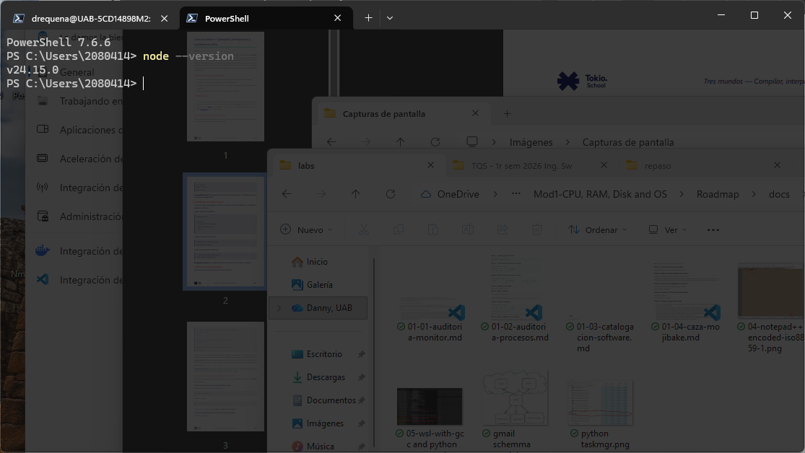
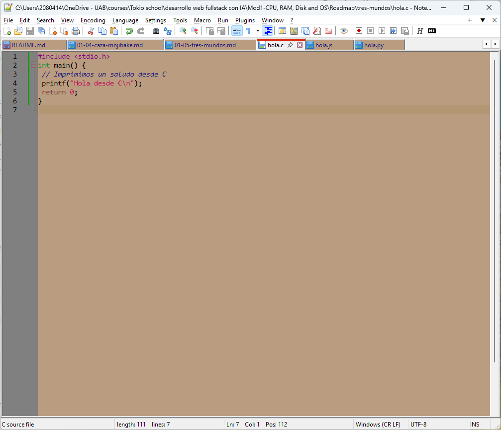
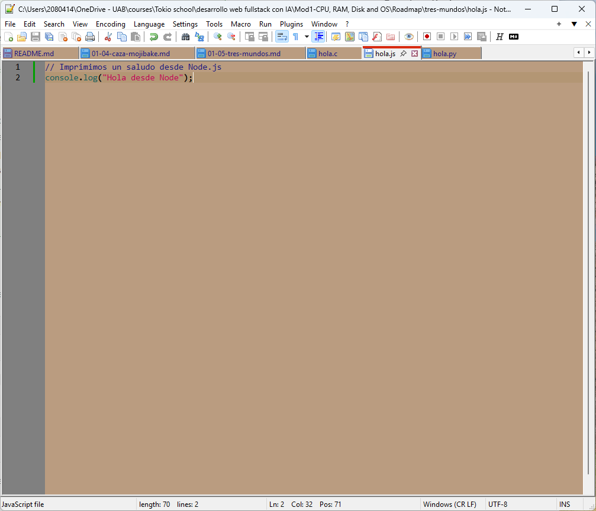

# Paso 1. Comprueba qué tienes instalado

En este caso como gcc no viene instalado en windows porque no es nativo de él, ejecuto WSL con un Ubuntu al que le tuve que instalar gcc. Y lo que no venía con ubuntu es node.js, así que en el caso de node usé el propio Windows que sí lo tenía instalado.




# Paso 2. Escribe los tres "Hola, mundo"






# Paso 3. Ejecuta cada uno y compara

En primer lugar, se ejecutó el programa en C en el entorno WSL, hubo que instalar previamente el paquete de apt **build-essential** (a parte del **gcc**) para que no diera error con la librería `stdio.h`. Como era de esperar se ha generado el binario ejecutable para Linux `hola` tal y como especificamos con el comando `gcc`.

```bash
drequena@UAB-5CD14898M2:/mnt/c/Users/2080414/OneDrive - UAB/courses/Tokio school/desarrollo web fullstack con IA/Mod1-CPU, RAM, Disk and OS/Roadmap/tres-mundos$ gcc hola.c -o hola
drequena@UAB-5CD14898M2:/mnt/c/Users/2080414/OneDrive - UAB/courses/Tokio school/desarrollo web fullstack con IA/Mod1-CPU, RAM, Disk and OS/Roadmap/tres-mundos$ ./hola
Hola desde C
```

En segundo lugar la salida de `hola.py`:

```cmd
PS C:\Users\2080414\OneDrive - UAB\courses\Tokio school\desarrollo web fullstack con IA\Mod1-CPU, RAM, Disk and OS\Roadmap\tres-mundos> py .\hola.py
Hola desde Python
```

En tercer lugar la salida de `hola.js`:

```cmd
PS C:\Users\2080414\OneDrive - UAB\courses\Tokio school\desarrollo web fullstack con IA\Mod1-CPU, RAM, Disk and OS\Roadmap\tres-mundos> node .\hola.js
Hola desde Node
```

# Paso 4. Provoca un error a propósito en cada uno

Compilación errónea de `hola.c` en mi máquina WSL de Windows. Se detecta el fallo en tiempo de compilación, ya que primero no llega a generar `hola` de nuevo (o lo sobreescribe), y porque detecta que estamos llamando a una función que no existe y eso lo detecta el mismo compilador. Además, la prueba está en que el error aparece al ejecutar el comando compilador `gcc` y no llegamos a ejecutar el binario `hola`:
```bash
drequena@UAB-5CD14898M2:/mnt/c/Users/2080414/OneDrive - UAB/courses/Tokio school/desarrollo web fullstack con IA/Mod1-CPU, RAM, Disk and OS/Roadmap/tres-mundos$ gcc hola.c -o hola
hola.c: In function ‘main’:
hola.c:5:2: error: implicit declaration of function ‘prntf’; did you mean ‘printf’? [-Wimplicit-function-declaration]
    5 |  prntf("Hola desde C\n");
      |  ^~~~~
      |  printf
```

Ejecución errónea de `hola.py`. En este caso es el propio runtime el que genera el error, ya que es interpretado.
```cmd
PS C:\Users\2080414\OneDrive - UAB\courses\Tokio school\desarrollo web fullstack con IA\Mod1-CPU, RAM, Disk and OS\Roadmap\tres-mundos> py .\hola.py
Traceback (most recent call last):
  File "C:\Users\2080414\OneDrive - UAB\courses\Tokio school\desarrollo web fullstack con IA\Mod1-CPU, RAM, Disk and OS\Roadmap\tres-mundos\hola.py", line 2, in <module>
    prnt("Hola desde Python")
    ^^^^
NameError: name 'prnt' is not defined. Did you mean: 'print'?
```

Ejecución erróne de `hola.js`. De igual modo que en python, se genera el error en el propio runtime de node:
```cmd
PS C:\Users\2080414\OneDrive - UAB\courses\Tokio school\desarrollo web fullstack con IA\Mod1-CPU, RAM, Disk and OS\Roadmap\tres-mundos> node .\hola.js
C:\Users\2080414\OneDrive - UAB\courses\Tokio school\desarrollo web fullstack con IA\Mod1-CPU, RAM, Disk and OS\Roadmap\tres-mundos\hola.js:2
consol.log("Hola desde Node");
^

ReferenceError: consol is not defined
    at Object.<anonymous> (C:\Users\2080414\OneDrive - UAB\courses\Tokio school\desarrollo web fullstack con IA\Mod1-CPU, RAM, Disk and OS\Roadmap\tres-mundos\hola.js:2:1)
    at Module._compile (node:internal/modules/cjs/loader:1830:14)
    at Object..js (node:internal/modules/cjs/loader:1961:10)
    at Module.load (node:internal/modules/cjs/loader:1553:32)
    at Module._load (node:internal/modules/cjs/loader:1355:12)
    at wrapModuleLoad (node:internal/modules/cjs/loader:255:19)
    at Module.executeUserEntryPoint [as runMain] (node:internal/modules/run_main:154:5)
    at node:internal/main/run_main_module:33:47

Node.js v24.15.0
```

# Paso 5. Borra el runtime/compilador a ver qué pasa (mental)

* ¿Cuáles de los tres archivos podrías ejecutar tal cual?
	- Respuesta: A priori ningún archivo con extensión podría, pero si el binario `hola` fue generado con anterioridad o con otro equipo con el comando `gcc`  para linux y estoy en linux, este sí que podría ejectuarlo, el resto de ninguna manera posible.
* ¿Cuál necesitaría que instalaras algo antes?
	- Respuesta: Node y python por la misma razón, ya que son los runtime.
* ¿En qué cambia la respuesta si en lugar del archivo `.c` tienes ya el binario `hola` compilado?
	- Respuesta: Ya contestado en la primera pregunta. El archivo `hola` es independiente del comando `gcc` ya que es lenguaje máquina y ejecutable por lo tanto.

# Paso 6. Cinco preguntas cortas

1. ¿Por qué `gcc` aparece como "compilador" y `node` como "runtime", aunque ambos te permiten ejecutar código?
	- Respuesta: Porque en realidad gcc no ejecuta código, sino convierte un código fuente en lenguaje C a un binario ejecutable, en cambio node es el intérprecte o runtime del archivo que se menciona.
2. ¿Qué necesita una máquina para ejecutar el binario `hola` compilado en C? ¿Y para ejecutar `hola.py`?
	- Respuesta: Para ejecutar un binario `hola` se necesita el sistema operativo adecuado. Y para ejecutar `hola.py` se necesita el intérprete o runtime de Python.
3. ¿En qué se parece V8 (el motor JIT de Node.js) a un compilador? ¿En qué se diferencia?
	- Respuesta: En que es un sistem híbrido y que compila ciertas partes del código para mejorar la eficiencia y velocidad si hay funciones que se repiten mucho. La diferencia es que en ciertas parates del código es interpretado línea a línea.
4. ¿Por qué un proyecto Next.js requiere `pnpm build` antes de desplegarse, en lugar de copiar tal cual el código fuente al servidor?
	- Respuesta: Porque el traspilador organiza y estructura en pro de la eficacia y eficiencia el código fuente para por ejemplo mniminzar código y ligerar por tanto lo qu ese tiene que leer de él, pero no solo eso sino que convierte typescript a javascript, porque typescript no es procesable directamente. Es decir, hace el **build** de lo estrictamente necesario para que sea procesable por el navegador u otro sistema.
5. Si un error de sintaxis aparece al ejecutar `node app.js` , ¿en qué fase está el problema según la clasificación del submódulo? ¿Y si aparece al lanzar `pnpm build`?
	- El error en `app.js` es error de interpretación del código fuente, que contiene un error sintáctico o de tiempo de ejecución, en cambio si es al lanzar `pnpm build` es que hay fallos en el código de traspilación previo al de ejecución.

