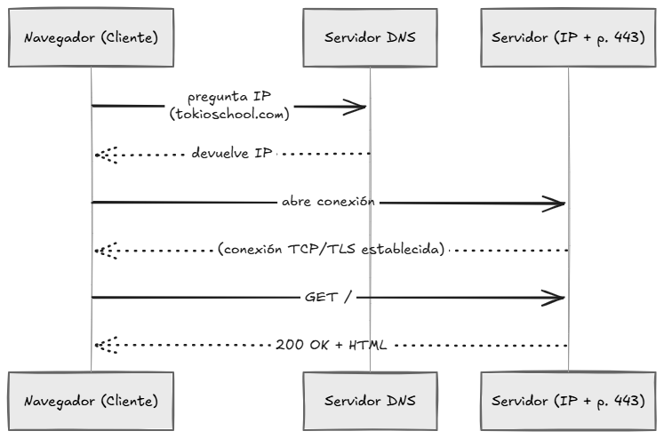

# Tema 6. Diseccionando una petición web - Del clic al servidor

## Tarea 1. Resuelve la IP del dominio

Se ha ejecutado en entorno Windows.
```cmd
PS C:\Users\2080414> nslookup tokioschool.com
Servidor:  UnKnown
Address:  192.168.18.1

Respuesta no autoritativa:
Nombre:  tokioschool.com
Addresses:  99.84.9.39
          99.84.9.101
          99.84.9.3
          99.84.9.70
```

## Tarea 2. Mide la latencia con ping

```cmd
PS C:\Users\2080414> ping -n 4 tokioschool.com

Haciendo ping a tokioschool.com [99.84.9.3] con 32 bytes de datos:
Respuesta desde 99.84.9.3: bytes=32 tiempo=15ms TTL=248
Respuesta desde 99.84.9.3: bytes=32 tiempo=16ms TTL=248
Respuesta desde 99.84.9.3: bytes=32 tiempo=15ms TTL=248
Respuesta desde 99.84.9.3: bytes=32 tiempo=18ms TTL=248

Estadísticas de ping para 99.84.9.3:
    Paquetes: enviados = 4, recibidos = 4, perdidos = 0
    (0% perdidos),
Tiempos aproximados de ida y vuelta en milisegundos:
    Mínimo = 15ms, Máximo = 18ms, Media = 16ms
```

Se nos dice que la media ha sido de 16 ms osea que la latencia es muy buena en este caso, y se puede observar que contesta una de las ip's de dominio detectadas, la 3a de la lista.

## Tarea 3. Traza el recorrido del paquete

```cmd
PS C:\Users\2080414> tracert tokioschool.com

Traza a la dirección tokioschool.com [99.84.9.39]
sobre un máximo de 30 saltos:

  1    11 ms     2 ms     1 ms  192.168.18.1
  2    19 ms     6 ms     6 ms  94.76.138.1
  3    38 ms     3 ms     3 ms  172.19.55.250
  4     7 ms     7 ms     7 ms  10.47.5.206
  5    15 ms    15 ms    15 ms  10.50.111.245
  6     *        *        *     Tiempo de espera agotado para esta solicitud.
  7     *        *        *     Tiempo de espera agotado para esta solicitud.
  8     *        *        *     Tiempo de espera agotado para esta solicitud.
  9     *        *        *     Tiempo de espera agotado para esta solicitud.
 10    18 ms    15 ms    15 ms  server-99-84-9-39.mad53.r.cloudfront.net [99.84.9.39]

Traza completa.
```

Se puede observar en la salida que hay varios saltos que no devuelven información, tal vez sea porque por seguridad cierran el protocolo de esta información para evitar saber nada de estos hubs o puntos. Hay un total pues de **10 saltos** para llegar a este host.

## Tarea 4. Mira las cabeceras HTTP con curl

```cmd
PS C:\Users\2080414> curl -I https://tokioschool.com
HTTP/1.1 301 Moved Permanently
Content-Type: text/html; charset=iso-8859-1
Connection: keep-alive
Date: Wed, 30 Sep 2026 08:03:02 GMT
Server: Apache
Location: https://www.tokioschool.com/
X-Cache: Miss from cloudfront
Via: 1.1 e51128cbc5c6c2bfa2ca665022eb945e.cloudfront.net (CloudFront)
X-Amz-Cf-Pop: MAD53-P8
X-Amz-Cf-Id: tH1h6jUZKZfFMlxbazoqI5TcjsoODRSPdgHBNqL1vgZInfAUB6OPow==

PS C:\Users\2080414> curl -I https://www.tokioschool.com
HTTP/1.1 200 OK
Content-Type: text/html;charset=utf-8
Connection: keep-alive
Date: Wed, 30 Sep 2026 08:03:04 GMT
Server: Apache
x-powered-by: Nuxt, Phusion Passenger(R) 6.1.8
X-Robots-Tag: index, follow, max-image-preview:large, max-snippet:-1, max-video-preview:-1
Status: 200 OK
Vary: Accept-Encoding
X-Cache: Miss from cloudfront
Via: 1.1 7cb5e6ca8e491181a91096729b24a17c.cloudfront.net (CloudFront)
X-Amz-Cf-Pop: MAD53-P8
X-Amz-Cf-Id: pzEpGWKooBnvlLoep4TUIge6uSOn4n5oFKAWLd5sco5oL6mqnKgqMg==
```

Es interesante observar que al intentar entrar sin `www` se nos da un error o código de error **301**, indicando que el dominio se ha movido permanentemente a otro error, indicando que hemos de ir a otra web. Esto el navegador lo haría de forma automática y veríamos que la dirección URL se convierte en la siguiente (**www.tokioschool.com**). Entonces realizamos a mano la siguiente ejecución que ya nos devuelve el status **OK** con la info correcta y que el estado es por tanto **200 OK**.

## Tarea 5. Disección de una URL

Rellena la tabla siguiente analizando esta URL:

```
https://tokioschool.com:443/cursos/desarrollo-web?nivel=junior&modalidad=online#temario
```

+-------------------+--------------------------------------------------------------+
|	Pieza			|	Valor													   |
+-------------------+--------------------------------------------------------------+
|Esquema 			|https|
|Host 				|tokioschool.com|
|Puerto 			|443|
|Ruta (path)		|cursos/desarrollo-web|
|Query string		|nivel=junior&modalidad=online|
|Parámetros del query|nivel,modalidad|
|Fragmento			|temario|
+-------------------+--------------------------------------------------------------+

**Entregable del paso 5**: la tabla rellena.

## Tarea 6. Provoca dos errores a propósito

**6.1 Error DNS**

Intento entrar en `http://www.tokyoschol.com` y obtengo el error `DNS_PROVE_FINISHED_NXDOMAIN` (Con Chrome puro), además en la consola **DevTools** no aparece nada en la pestaña de _Network_. El error exacto es:
```
No se puede acceder a este sitio web
Comprueba si hay un error de escritura en www.tokyoschol.com.

Si está escrito correctamente, prueba a ejecutar el diagnóstico de red de Windows.
DNS_PROBE_FINISHED_NXDOMAIN
```

En este caso es un error de **DNS**, que no puede resolver nadie del eslabón esta dirección.

**6.2 Error de conexión rechazada**

Primero compruebo con `netstat -na | findstr 9999` que no devuelve nada, con lo cual el puerto 9999 se puede asegurar que está libre o no hay nadie escuchando, entonces proceso lo siguiente y obtengo los resultados:

```cmd
PS C:\Users\2080414> curl http://localhost:9999
curl: (7) Failed to connect to localhost:9999 after 2239 ms: Could not connect to server
```

En este caso el error del eslabón es de **Puerto/Servidor**, en este caso podemos deducir que al dominio si puede entrar porque es local pero ha fallado por el puerto **TCP/IP**.

## Tarea 7. Dibuja el diagrama del viaje

