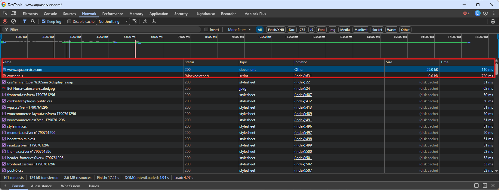

# Conversaciones HTTP en vivo — DeDevTools a curl

## Tarea 1. Observa una navegación real con DevTools

Abre Chrome (Firefox o Safari también valen), pulsa **F12** o **Cmd+Opt+I** (macOS) y ve a la pestaña **Network**. Asegúrate de tener activada la casilla **Preserve log** para que no se borren las peticiones al cambiar de página.

Navega a <https://github.com> (o <https://tokioschool.com>). Vas a ver **decenas** de peticiones: HTML, CSS, JavaScript, imágenes, fuentes, APIs internas. Elige una petición de tipo `document` (la primera, la del HTML principal) y rellena la tabla:

+------------+--------------------+
|Pieza		| Valor que ves		|
+------------+------------------+
|URL completa |https://www.aquaservice.com/|
|Método|GET|
|Código de estado|200 OK|
|Content-Type de la respuesta |text/html; charset=utf-8|
|Server (si aparece)|cloudfare|
|¿Hay alguna Set-Cookie ? Cita una si la ves|N/A|



## Tarea 2. Cinco peticiones con curl

En tu terminal, ejecuta las cinco peticiones siguientes una a una. Por cada una, anota el código de estado y al menos una cabecera interesante de la respuesta.

> 📌 En Windows, curl viene incluido en Windows 10+ desde la línea de comandos (cmd, PowerShell). Si usas WSL o macOS/Linux, funciona igual.

```
# 2.1 — GET simple a una API pública
curl -i https://api.github.com/users/octocat
```

* **Método y URL**: GET `https://api.github.com/users/octocat`
* **Código HTTP**: 200 OK
* **Cabecera interesante**: `Cache-Control: public, max-age=60, s-maxage=60`
* **Método CRUD**: Lectura (select)

```
# 2.2 — Solo cabeceras (sin cuerpo)
curl -I https://tokioschool.com
```

* **Método y URL**: GET `https://tokoschool.com`
* **Código HTTP**: 301 Moved Permanently
* **Cabecera interesante**: `Location: https://www.tokioschool.com/`
* **Método CRUD**: Lectura (select)

```
# 2.3 — POST con cuerpo JSON contra httpbin (devuelve eco)
curl -i -X POST https://httpbin.org/post \
-H "Content-Type: application/json" \
-H "Accept: application/json" \
-d '{"nombre":"Lucia","nivel":"junior"}'
```

**NOTA**: El modo _mulit-line_ en Windows, las separaciones son con `\`` en vez de `\\`. Es decir, la llamada quedaría así:
```cmd
PS C:\Users\2080414> curl -i -X POST https://httpbin.org/post `
>> -H "Content-Type: application/json" `
>> -H "Accept: application/json" `
>> -d '{"nombre":"Lucia","nivel":"junior"}'
```
* **Método y URL**: POST `https://httpbin.org/post`
* **Código HTTP**: 200 OK
* **Cabecera interesante**: `Content-Type: application/json`
* **Método CRUD**: Escritura (insert)

```
# 2.4 — GET con un parámetro en el query string
curl -i "https://httpbin.org/get?nivel=junior&modalidad=online"
```
* **Método y URL**: GET `https://httpbin.org/get?nivel=junior&modalidad=online`
* **Código HTTP**: 200 OK
* **Cabecera interesante**: `Access-Control-Allow-Credentials: true`
* **Método CRUD**: Lectura (select)

```
# 2.5 — Cabecera Authorization de prueba (ver que httpbin la refleja)
curl -i https://httpbin.org/bearer \
-H "Authorization: Bearer mi-token-de-prueba"
```
* **Método y URL**: GET `https://httpbin.org/bearer`
* **Código HTTP**: 200 OK
* **Cabecera interesante**: `Access-Control-Allow-Origin: *`
* **Método CRUD**: Lectura (select)

## Tarea 3. Provoca tres códigos de error distintos

Tu objetivo es ver cada error con tus ojos y entender por qué saltó cada uno.

**3.1 Un 404 Not Found**

```cmd
curl -i https://api.github.com/users/este-usuario-no-existe-12345
```

* Salida: `HTTP/1.1 404 Not Found`.
* Cuerpo (varias líneas): `{  "message": "Not Found",  "documentation_url": "https://docs.github.com/rest",  "status": "404" }`
* Error de ruta.


**3.2 Un 401 Unauthorized**

```cmd
curl -i https://httpbin.org/bearer
```
Sin la cabecera Authorization , la API rechaza la petición. Observa el mensaje.

* Salida: `HTTP/1.1 401 UNAUTHORIZED`
* Cuerpo: N/A
* Error de autentiecación (no sabe quien somos).

**3.3 Un 400 Bad Request (JSON malformado)**

```cmd
curl -i -X POST https://httpbin.org/post \
-H "Content-Type: application/json" \
-d '{nombre malformado}'
```

* Salida: `HTTP/1.1 200 OK`
* Cuerpo: `"args": {},"`
* No devuelve ningun error 400 (debería, como formato del cuerpo), deben haber cambiado algo en el sistema de mensajería o formato, pero se observa que el json devuelto como key del propio json de respuesta es **null**, así que eso hace ver estaría mal formado o rechazado el de entrada.

## Tarea 4. Inspecciona una cookie real

Entra (con DevTools abierto, pestaña **Network**) a un sitio donde ya tengas cuenta (`github.com`, `linkedin.com`, tu correo, lo que tengas a mano). **Asegúrate de estar logueado**.

Recarga la página, selecciona cualquier petición a ese dominio y mira:
* La pestaña **Headers**: busca la cabecera `Cookie` enviada por tu navegador.
* La pestaña **Cookies** de la misma petición (Chrome la separa).
* En **Application → Storage → Cookies** (Chrome) puedes ver todas las cookies del dominio con sus atributos.

Rellena esta tabla con una cookie de sesión real (no copies el valor completo si te incomoda — basta con el nombre y los atributos):

He usado mi gmail (`mail.google.com`). Se observa que no hay ni una sola cookie que contenga texto plano (debido al nivel altísimo de ofuscación y seguridad de Google).

+-------------+----------------+
|Atributo 		|Valor			|
+-------------+----------------+
|Nombre|AEC=`Aaa9EJqB2sdHrm6Ysf57jwEGEu3oHZj04XkZ4YPiyQ9bYIzLrAajzBXJ934`|
|¿`HttpOnly`?| sí |
|¿`Secure`?| sí |
|¿`SameSite`?| Lax|
|¿Cuándo expira?| 2027-03-07T09:57:48.276Z |
|Dominio | `.google.com`|
+------------+------------------+

