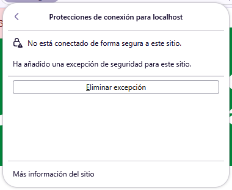
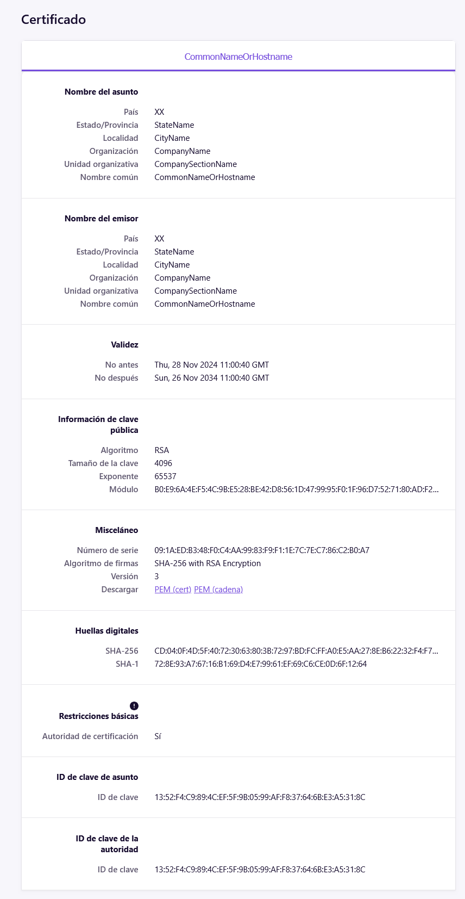
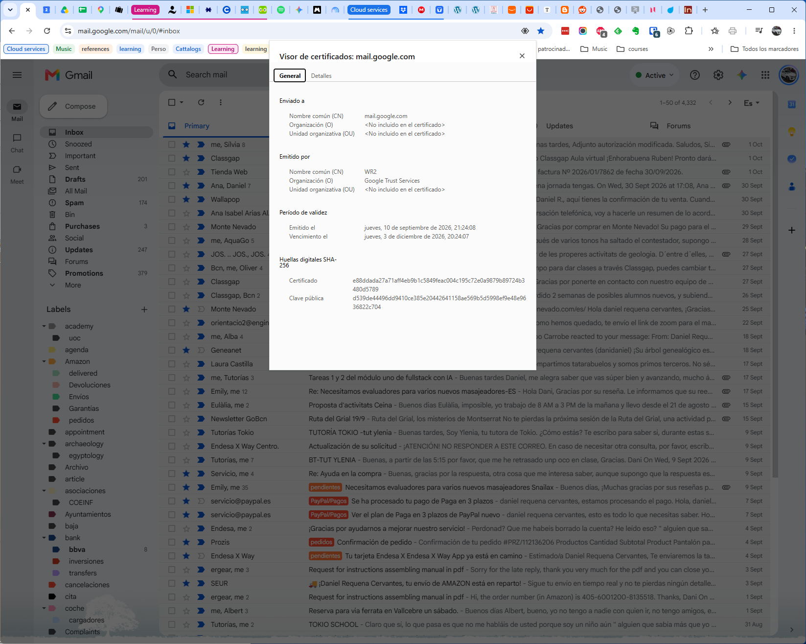
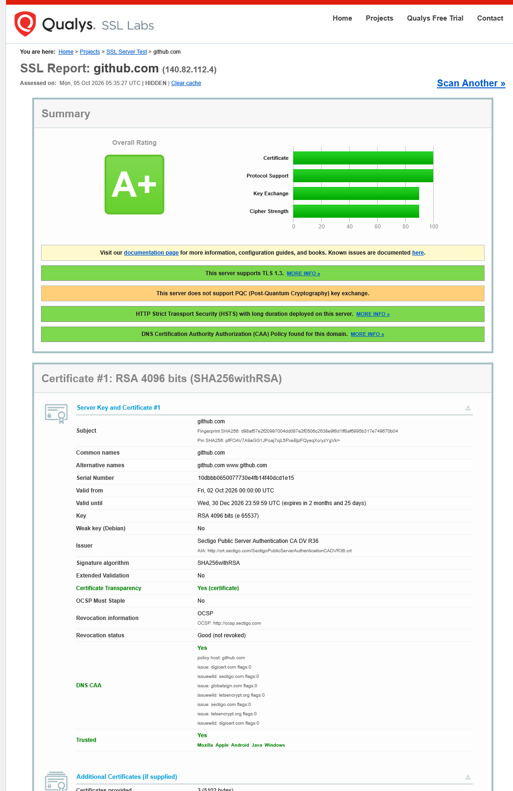
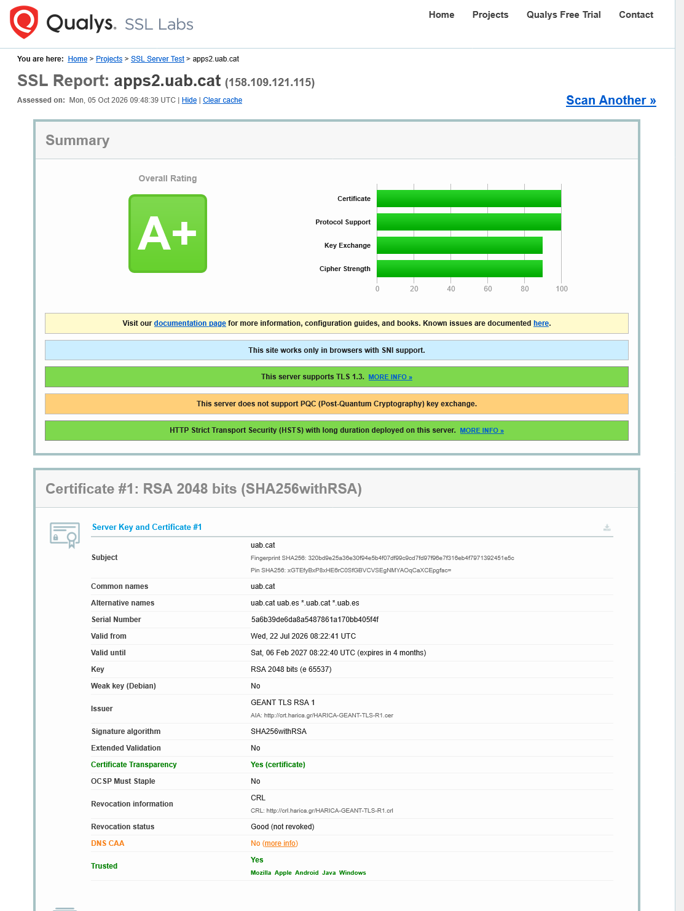
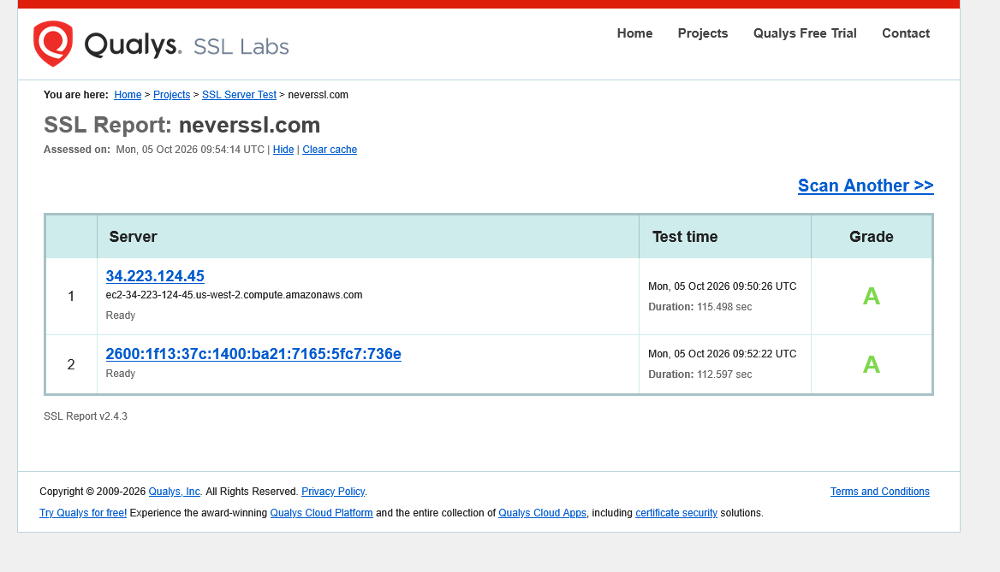

# Tema 8. Auditoría HTTPS de tres sitios

## Tarea 1. Elige tres sitios y mira el candado

Abre tu navegador. Visita los tres sitios siguientes (o equivalentes que prefieras):

1. **Sitio grande**: https://github.com o https://wikipedia.org.
2. **Sitio pequeño**: tu propio dominio si tienes, el de un familiar o un sitio modesto que conozcas (busca uno que sirva HTTPS).
3. **Sitio sin HTTPS**: http://neverssl.com (existe a propósito para que se pueda probar HTTP en redes que fuerzan HTTPS).

Para cada uno, rellena esta tabla:

+-------------+-----------------------------+--------------------------+------------------------------------+
|Sitio 			|URL 				|			¿Candado en la barra?	| Aviso del navegador (si hay)		|
+-------------+-----------------------------+--------------------------+------------------------------------+
|Grande |https://github.com/| sí | N/A |
|Pequeño |https://localhost/enrollment/| no | (Firefox) No seguro // No está conectado de forma segura en este sitio (El candado aparece con barra en rojo que lo tacha) |
|Sin HTTPS |http://neverssl.com | no | (Chrome) La conexión con este sitio web no es segura |





## Tarea 2. Inspecciona el certificado de uno de los sitios HTTPS

Elige el sitio grande o el pequeño (el que tenga HTTPS y candado). En Chrome haz clic en el candado → "Connection is secure" → "Certificate is valid". En Firefox: clic en el candado → "Connection secure" → "More information" → "View Certificate". Verás un panel con toda la información del certificado.

Rellena la tabla:

1. Para el certificado "falso" de localhost para WAMPP:

|Atributo 		|Valor						|
|-------------|-------------------------------|
|Sitio analizado |https://localhost/enrollment/|
|Emisor (CA) | CommmonNameOrHostname (default) |
|Dominio principal (Common Name o SAN) |N/A|
|Otros dominios cubiertos |N/A|
|Válido desde |Thu, 28 Nov 2024 11:00:40 GMT|
|Válido hasta |Thu, 26 Nov 2034 11:00:40 GMT|
|Algoritmo de firma |RSA con 4096 de tamaño|

2. Para el certificado válido de google:

|Atributo 		|Valor						|
|-------------|-------------------------------|
|Sitio analizado |https://mail.google.com|
|Emisor (CA) | WR2 |
|Dominio principal (Common Name o SAN) |mail.google.com|
|Otros dominios cubiertos |N/A|
|Válido desde |Thu, 10 Sep 2026 21:24:08|
|Válido hasta |Thu, 3 Dec 2026 20:24:07|
|Algoritmo de firma |SHA-256|





## Tema 3. Inspecciona el certificado desde la terminal

Ejecuta este comando, sustituyendo el dominio por uno de los HTTPS que elegiste:
```
openssl s_client -connect github.com:443 -servername github.com < /dev/null 2>/dev/null |
openssl x509 -noout -subject -issuer -dates
```

La salida muestra:
* `subject=`: a quién pertenece el certificado.
* `issuer=`: quién lo firmó (la CA).
* `notBefore= / notAfter=`: fechas de validez.

Para ver la cadena completa de certificados (servidor → CA intermedia → raíz):
```
openssl s_client -connect github.com:443 -servername github.com -showcerts < /dev/null
2>/dev/null | grep -E "subject=|issuer="
```

```bash
drequena@UAB-5CD14898M2:~$ openssl s_client -connect mail.google.com:443 -servername google.com < /dev/null 2> /dev/null  | openssl x509 -noout -subject -issuer -dates
subject=CN=*.google.com
issuer=C=US, O=Google Trust Services, CN=WR2
notBefore=Sep 10 19:21:53 2026 GMT
notAfter=Dec  3 19:21:52 2026 GMT

drequena@UAB-5CD14898M2:~$ openssl s_client -connect mail.google.com:443 -servername google.com -showcerts < /dev/null 2
> /dev/null  | grep -E "subject=|issuer="
subject=CN=*.google.com
issuer=C=US, O=Google Trust Services, CN=WR2
```
Considero que solo hay un certficiado que conforma la cadena y que contiene varios niveles por certificado, es decir, nombre común CN es **WR2**, luego la organización es **Google Trust Services** y el país es **US** (Estados Unidos).

## Tarea 4. Audita los tres sitios con SSL Labs

Ve a <https://www.ssllabs.com/ssltest/> y mete los **dos sitios HTTPS** de los pasos anteriores. El análisis tarda 1-3 minutos por sitio. Mientras esperas a uno, puedes lanzar el siguiente.

Para el sitio HTTP (neverssl.com) SSL Labs no podrá analizarlo (no hay TLS), así que en ese basta con anotar el resultado del paso 1.

Rellena esta tabla:

|Sitio 		|Nota SSL Labs 	| Observación principal (la primera que destaca)|
|-----------|---------------|-----------------------------------------------|
|Grande (<https://github.com/>) 	|A+ |TLS 1.3 activo, HSTS habilitado|
|Pequeño (<https://apps2.uab.cat/enrollment/>) 	|A+ |TLS 1.3 activo, HSTS habilitado|
|Sin HTTPS (http://neverssl.com)	|N/A 			|No tiene TLS; el navegador marca "Not secure"|

NOTA: El site pequeño es el mismo que localhost de la tarea 1 pero en producción.

Compara los dos sitios analizados: ¿cuál saca mejor nota? ¿En qué se diferencia su configuración?







En resumen de los dos primeros sitios se obtiene una misma puntuación buena y mismo baremo en todo, key exchange y cipher strenght al 90% en ambos sitios. Lo cual dice que no tiene que ver que un site pequeño tenga un certificado "menos válido" o más débil que uno mayor. Respecto el sitio neverssl obtiene buena puntuación a pesar de no usar ssl.