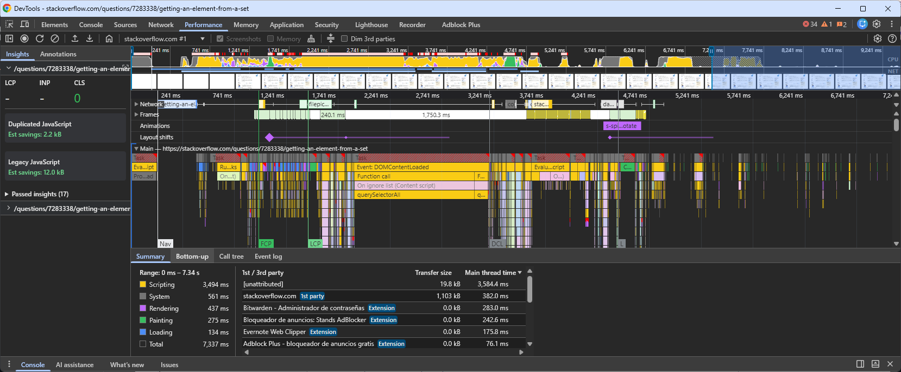
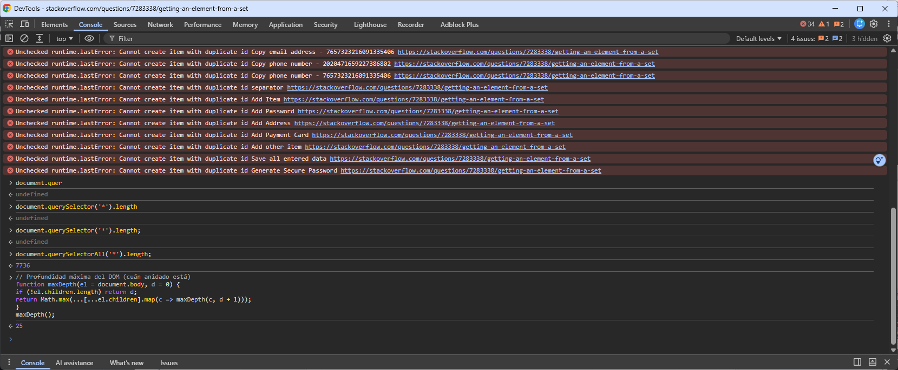
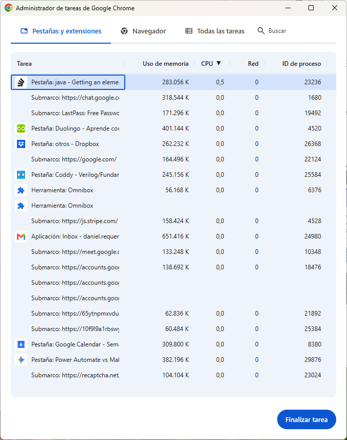

# Tema 9. Disección de una carga de página - Del HTML al pixel

## Tarea 1. Recursos descargados (Network)

Elige una web pública. Recomendaciones: <https://github.com>, <https://tokioschool.com> o cualquier landing que conozcas. Evita webs muy ligeras (`example.com`) para que el ejercicio tenga miga.

Abre DevTools (`F12` o `Cmd+Opt+I`), ve a la pestaña **Network**, marca la casilla **Disable cache** y la **Preserve log** si está disponible. Recarga la página con `Cmd+R` o `Ctrl+R`.

Identifica los primeros **5 recursos descargados** (los de arriba del todo) y rellena esta tabla:

|# |Nombre |Tipo (document, script, stylesheet, image, font, fetch…) |Tamaño |Tiempo|
|1 |getting-an-element-from-a-set|document|107 kB|1.05 s|
|2 |otSDKStub.js|script|0.0 kB|139 ms|
|3 |google-analytics.en.js?v=48615a9a9bc4|script|2.8 kB|435 ms|
|4 |jquery.min.js|script|30.5 kB|7.39 ms|
|5 |stub.en.js?v=257180ffb350|script|19.6 kB|1.36 s|


## Tarea 2. Perfil de Performance

Sin cerrar DevTools, ve a la pestaña **Performance**. Pulsa el botón **Reload and start profiling** (el icono circular con flecha). Espera a que termine la grabación (Chrome la para sola al cabo de unos segundos).

Cuando termine, el panel muestra un timeline con muchas barras de colores. Busca al inicio del timeline tres métricas marcadas con líneas verticales:
* **FP / FCP** (First Contentful Paint): primer momento en que el navegador pinta contenido.
* LCP (Largest Contentful Paint): cuándo se pintó el mayor elemento visible (suele ser una imagen o un bloque de texto grande).

Y busca en la línea **Main** segmentos rojos triangulares: esas son las **long tasks** (tareas que bloquearon el hilo principal más de 50 ms).

Rellena la tabla:

|Métrica 				|Valor			|
|-----------------------|:-------------:|
|FCP 					| ~1.741 ms		|
|LCP					| >3.241 ms		|
|Duración total grabada |9-10 s			|
|Long tasks observadas 	|Event: DOMContentLoaded (3.494 ms)|

Se cargó uso de nuvo la web `stackoverflow.com`, con un hilo cargado que estaba consultando para un trabajo y estos son los resultados obtenidos.



## Tarea 3. Tamaño del DOM

Ve a la pestaña **Console** y ejecuta:
```javascript
document.querySelectorAll('*').length;
```

Eso devuelve el número total de nodos del DOM. Apunta el resultado. Como referencia: una landing sencilla tiene 200-800 nodos; una app compleja tipo Gmail o Notion abierta en su día a día puede tener miles o decenas de miles.

Ejecuta también:
```javascript
// Profundidad máxima del DOM (cuán anidado está)
function maxDepth(el = document.body, d = 0) {
	if (!el.children.length) return d;
	return Math.max(...[...el.children].map(c => maxDepth(c, d + 1)));
}
maxDepth();
```

De nuevo se ha elegido la web `stackoverflow.com`, mismo thread que pasos enteriores. Nos encontramos que el número de nodos total es de **7736** y que el nodo com más profundidad es de 25. Teniendo en cuenta que se menciona que una web compleja puede tener miles de nodos, pues es normal que esta tenga más de 7k, rozando 8k, pues hay que tener en cuenta que al ser un thread, hay muchos mensajes y cada mensaje tiene su estilo y elementos html que van haciendo crecer la página en total, a parte que no usa scroll infinito, lo cual lo carga todo en el misimo momento de la llamada.



## Tarea 4. Procesos del navegador

Abre el monitor del sistema (Administrador de tareas en Windows, Monitor de Actividad en macOS, System Monitor en Linux) y filtra/busca por "Chrome" o el navegador que estés usando. Cuenta cuántos procesos aparecen con esa única pestaña abierta.

Chrome también tiene su propio Task Manager interno muy útil: **Shift+Esc** (Windows/Linux) o **Window → Task Manager** desde la barra de menú (macOS). Te muestra cuántos procesos hay, qué tipo es cada uno (Tab, Extension, GPU Process, Network Service...) y cuánto consume cada uno.

Rellena:

| Origen						| número			|
|-------------------------------|:-----------------:|
| Procesos totales con esa pestaña abierta |16 (en taskmgr de Windows marca 30)|
| Procesos de tipo "Tab"		|9|
| Procesos de extensiones		|3 (van variando)|
| Memoria total agregada de Chrome |3340 MB (según taskmgr de Windows)|

Se observa que si las extensiones no se abren o expanden, no generan ningún proceso.

