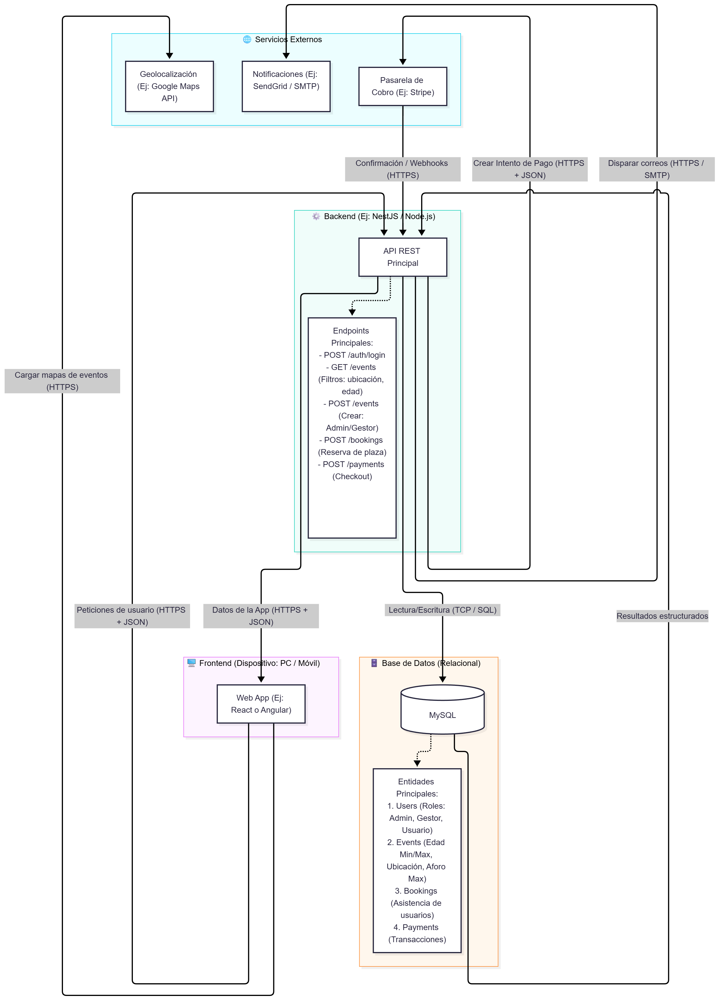

# Tema 10. Triángulo de la app que más usas - Y diagrama de tu proyecto

## Terea 1. Elige una app y dibuja su triángulo

Elige UNA app que uses a diario. Ejemplos sugeridos: **WhatsApp**, **Spotify**, **Notion**, **GitHub**, **Instagram**, **Twitch**. Para tres funcionalidades distintas de esa app, deduce qué crees que pasa en cada vértice del triángulo.

Las funcionalidades sugeridas son:
* **A**: ver la pantalla principal (feed, lista de chats, repositorios...).
* **B**: hacer una búsqueda dentro de la app.
* **C**: crear contenido (mandar un mensaje, escribir un comentario, hacer un commit, lo que aplique).

Rellena esta tabla (no tienes que acertar al 100 %; lo importante es el razonamiento):

| Funcionalidad | Frontend hace | Backend hace | Base de datos hace |
|---------------|---------------|--------------|--------------------|
|A. Pantalla principal |Buscar cambios en los chats y dibujar ordenado por mensaje más reciente la lista, usa la caché previa si no hay cambios|Recibe una petición GET y devuelve un JSON con la lista id's de chat actualizados reordenados por mensaje más reciente|Consultar en orden la lista de chats filtrado por pertenecia al usuario en concreto que le manda el backend|
|B. Búsqueda |Renderizar una lupa con un input para poder escrbiri algo y lanzar por JSON un GET con la secuencia de búsqueda|Recibe un token o secuencia y lanza una query a la bbdd|Recibe una sequencia de palabras y filtra mensajes que contengan esa secuencia pero solo en los chats que pertencen a un id dado|
|C. Crear contenido |Dibuja la pantalla de chat en concreto con los mensajes en caché y los nuevos recibidos en caso que haya y dibuja un input con el botón enviar. Se manda por POST un JSON con el nuevo mensaje y/o contenido multimedia|Recibe el JSON y el token de usuario bearer o como fuera y su contenido multimedia y envía estos datos a bbdd|Realiza un INSERT con el usuario dado en un id de chat dado para realizar la inserción de contenido de un usuario a un chat sea privado o grupo|

La app elegida en mi caso es **Telegram**.

## Tarea 2. Hipotetiza el stack tecnológico

A partir de pistas visibles desde fuera (rendimiento, comportamiento sin conexión, características de la UI, lo que digan los empleados en sus charlas técnicas o lo que puedes ver con `view-source` en su web) hipotetiza qué stack podría usar la app que has elegido:

|Capa 					|Tecnología que sospechas |Justificación|
|-----------------------|-------------------------|-------------|
|Lenguaje del frontend 	|Javascript nativo||
|Framework de frontend	| Otro:N/A |No se puede discernir, visto los poco archivos js que hay, solo hay dos, uno que es una redirección de location.href y otro para verificar compatibilidades varias, el resto son modulepreload (me faltan conocimientos para detectar esto)|
|Lenguaje del backend 	| Otro:N/A |Es complicado saber esto si no tenemos acceso a los servidores|
|Tipo de base de datos 	|N/A |Por lo mismo que el backend, no se puede saber a priori|

> 📌 No hace falta acertar exactamente; lo que se valora es la capacidad de razonar sobre las pistas (qué framework de UI usa Twitch se puede ver en DevTools; el stack in terno de WhatsApp aparece en charlas técnicas; etc.). Está bien marcar "no sabría decir, posibles opciones: X, Y, Z".

Abrimos la url de telegram web (<https://web.telegram.org>). Dada la ofuscación de código y falta de conocimientos, cuesta mucho rellenar la tabla con datos fehacientes. Preguntamos a la IA (Gemini) el siguiente prompt:

> Averiguar si se puede saber qué lenguaje de frontoent, así como framework, y lenguaje de bakend así como base de datos interna de telegram y si está documentado o cómo se puede averiguar con ver el código fuente de la web con `view-source`.

**Fronend: lenguajes y frameworks (Telegram web)**

La IA contesta que el **Lenguaje de frontend** está desarrollado casi en su totalita en **TypeScript** en un 90% apoyado sobre **JavaScript**, **HTML5** y **SCSS/CSS**.

Respecto los **Frameworks de frontend** comenta que:

> **Frameworks**: Para mantener una velocidad extrema y un tamaño de carga mínimo, Telegram Web evita los frameworks pesados (como Angular o un React completo). Utilizan arquitecturas muy ligeras construidas con componentes propios de Vanilla TypeScript/JavaScript o versiones muy optimizadas (como Preact en algunos forks), empaquetadas con Vite o Webpack. Para comunicarse con la red de Telegram, utilizan librerías como GramJS (que implementa el protocolo criptográfico MTProto en JavaScript).

Para averiguar esto del frontend comenta que con `view-source` solo vemos los archivos `.js` compilador y que con **DevTools** lo vereímso todos ofuscado y sería imposible de deducir sin aplicar ingeniería infersa. Pero al ser el frontend de Telegram **Open Source**, existe un repo de código abierto donde poderlo ver, que es la página oficial pública de GitHub: `TelegramOrg/Telegram-web-z` y `TelegramOrg/Telegram-web-k`.

**Backend y base de datos**

* **Lenguaje del Backend**: El núcleo de los servidores de Telegram está programado en **C** y **C++**. Esto es esencial porque necesitan un rendimiento puro, bajísima latencia y control absoluto de la memoria para procesar millones de mensajes por segundo mediante su protocolo de encriptación propietario.
* **Base de datos interna**: Telegram no utiliza bases de datos relacionales comerciales clásicas (como un simple MySQL, PostgreSQL u Oracle) para su núcleo de mensajería. Utilizan un sistema de base de datos distribuida y altamente personalizada, diseñada a medida por el equipo de Nikolai Durov. Está repartida en clústeres a nivel global para sincronizar el estado de los chats casi instantáneamente.

**¿Se puede averiguar el Backend/Base de datos usando `view-source`?** Es técnicamente imposible. Por el propio diseño y arquitectura de la web, la herramienta view-source solo muestra lo que el servidor le ha enviado a tu navegador (HTML/CSS/JS). El código del backend (C++) y las bases de datos viven únicamente en las máquinas de Telegram. Cuando interactúas con la web, tu navegador solo envía y recibe datos (paquetes binarios vía WebSockets), pero el servidor jamás revela cómo está programado por dentro ni dónde guarda los datos por estrictas razones de seguridad.

**Está documentada esta info?**

Depende de la capa arquitectónica:

1. **Frontend y Cliente**: Totalmente documentado. Como se mencionó, todo el código está en GitHub a disposición de cualquier desarrollador.
2. **La API y la Comunicación**: Exhaustivamente documentada. La forma en la que el frontend habla con el backend (el protocolo MTProto y TDLib) está explicada con detalle en **core.telegram.org**. Esto permite que cualquiera pueda programar su propia aplicación de Telegram desde cero.
3. **Backend y base de datos**: No están documentados públicamente (Closed Source). Telegram mantiene el código de sus servidores y bases de datos como código propietario y secreto. Conocer su infraestructura exacta, esquemas de tablas o algoritmos de balanceo de carga es imposible, y lo que se sabe (C++ e infraestructura distribuida) **proviene de entrevistas técnicas de sus fundadores y notas de ingeniería a lo largo de los años**.

## Tarea 3. Traza el viaje de UNA acción concreta

Elige UNA acción concreta y traza paso a paso qué crees que ocurre en cada vértice del triángulo. Sugerencias:
* **WhatsApp**: enviar un mensaje a un contacto.
* **Spotify**: pulsar "Reproducir" en una canción.
* **GitHub**: hacer push de un commit.
* **Notion**: crear una página nueva.

Numera los pasos de 1 a 8 aproximadamente, indicando para cada uno qué vértice está actuando. Ejemplo de estilo:
```
1. (FRONT) El usuario toca el botón de enviar.
2. (FRONT) La app valida que el mensaje no esté vacío.
3. (FRONT → BACK) Envía POST /messages por HTTPS con el cuerpo y la sesión.
4. (BACK) Valida sesión y permiso (el remitente puede escribir a este destinatario).
5. (BACK → DB) Inserta el mensaje en la BD asociado a la conversación.
6. (BACK) Notifica al destinatario (push notification, websocket…).
7. (BACK → FRONT) Responde 201 al remitente.
8. (FRONT) Muestra el mensaje como entregado.
```

Mi versión eligiendo **Spotify** al pulsar "Play" en una canción.
```
1. (FRONT) El usuario pulsa el botón Play del triángulo y al poner el ratón encima se genera un efecto.
2. (FRONT) El código busca la varaible que almacenaba el estado actual de la canción desde su última parada (si estaba en pausa, si había una canción pendiente de sonar de un album o playlist, etc...)
3. (FRONT → BACK) Envía por GET /play/<id_cancion> por HTTPS y por headers el token de sesión iniciada. Además añade info extra por el body en json del minuto en que estaba sonando esa canción.
4. (BACK) Valida la sesión y el token recibido y que el usuario tenga derecho a estuchar el id de canción.
5. (BACK → DB) Consulta el id de canción y obtiene la conexión en streaming de los bytes que conforman la canción en el punto escogido.
6. (BACK → FRONT) Establece un canal de comunicación por streaming para comenzar la transmisión de la canción.
7. (FRONT) Abre el canal streaming al verificar que es válido el canal de envío (por cookie)
8. (FRONT) Inicia la reproducción por dispositivo de audio predeterminado usando la API de un reproductor o del navegador mismo o con un contenedor `audio` html + javascript.
```

## Tarea 4. Decisiones de "dónde poner cada cosa"

Para una **app de pedidos online ficticia**, decide dónde colocarías cada una de estas tres responsabilidades. Justifica en 1-2 líneas.

|Responsabilidad 														|Frontend 	| Backend 	| BD|
|-----------------------------------------------------------------------|:---------:|:---------:|:--:
|Validar que la cantidad de un producto en el carrito no es negativa	| V | V | X |
|Calcular el IVA y el total final del pedido antes de cobrar 			| X | X | V |
|Recordar la preferencia de tema visual (claro/oscuro) del usuario 		| V | X | X |

Tras la tabla, escribe en 3-4 líneas qué patrón ves: ¿qué tipo de decisiones se quedan solo en el front?, ¿cuáles requieren back obligatorio?, ¿cuándo aparece la BD? 

He marcado como decisiones del frontend aquellas que afectan directamente al usuario como es el tema claro oscuro, que se puede gestionar directamente con `localStorage`, pues aunque es modificable no implicaría un riesgo de seguridad en absoluto salvo molestias a sí mismo, y para que la cantidad no sea negativa, pues esto que no permita la página poner números menores que 0. Asimismo el backend debe comprobar también que la cantidad sea un número positivo, porque aunque lo valide el frontend se puede alterar mediante postman o devtools dicho valor, entonces el back puede o bien ignorarlo asumiendo un 0 o bien generar un error al cliente. Respecto la base de datos he decidido que sea el cálculo del precio porque es la única que tiene potestad absoluta sobre los precios finales y que sea la misma query la que haga el cálculo final, aunque también podría hacer esto el backend pero los precios se los manda siempre la BBDD para que en caso de alterarlos en frontend estos nunca puedan llegar a alterar la BBDD.

## Tarea 5. Diagrama de arquitectura de tu proyecto del Roadmap

Este paso es el **entregable principal del módulo 2** del Roadmap. Vas a dibujar un diagrama de arquitectura "rough" (versión preliminar) de la aplicación que tú vas a construir en el Roadmap.

El diagrama debe incluir, como mínimo:
* El **frontend** (qué dispositivo lo ejecuta, qué framework usarás).
* El **backend** (qué lenguaje/framework, qué endpoints principales).
* La **base de datos** (qué tipo, qué entidades principales).
* Las **flechas** entre ellos indicando qué viaja en cada dirección (HTTPS + JSON, SQL, etc.).
* Cualquier **servicio externo** que vayas a integrar (autenticación, emails, pagos, AI…).

Puedes usar Excalidraw (recomendado), Miro, draw.io, papel + foto, lo que te resulte más cómodo. El objetivo no es elegancia gráfica sino que cada pieza esté nombrada y las flechas tengan etiqueta.

A falta de conocer qué tegnologías front y back hay porque no he empezado el curso, he elegido tecnologías de alto nivel con prepros y builders como typescript, nestjs / node.js y otros. El proyecto es un gestor de eventos que permite crear speed datings con sus peculiaridades de máximo de asistentes y franjas de edad, separando por sexos. El archivo generador con flowchart TD es [rough.md](../docs/architecture/rough.md) y el diagrama.

